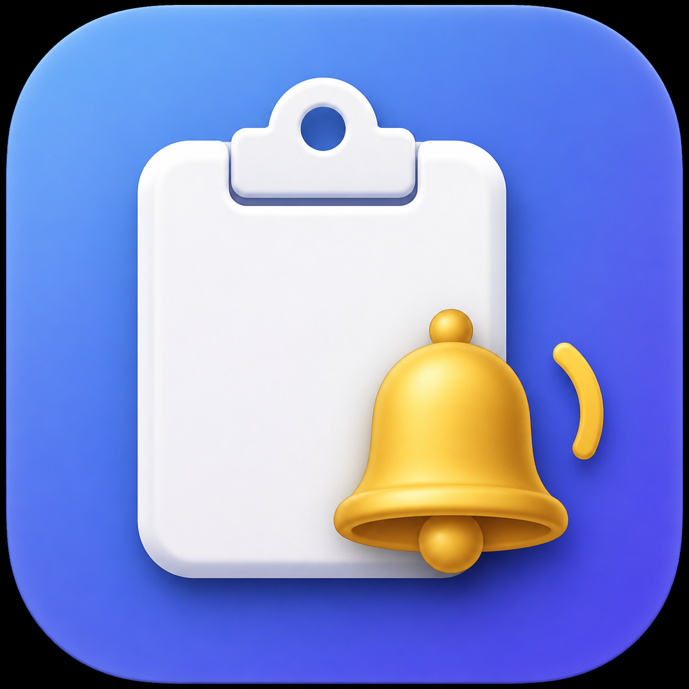

<p align="center">
  
</p>

# CopyDing

CopyDing is a tiny native macOS menu-bar utility that lets you know when a Copy command fails. It plays the familiar macOS alert sound and can also show a small red **Copy failed** visual overlay near your pointer, so silent copy failures are easy to spot.

It helps with applications, remote desktops, webpages, and other interfaces where a copy command can silently fail.

**CopyDing is Developer ID signed and notarized by Apple for direct distribution outside the Mac App Store.**

## Features

- Audible warning when a detected Copy command does not update the clipboard
- Optional red **Copy failed** visual overlay near the pointer
- Menu bar toggle for **Visual Failure Alert**
- Four adjustable alert timings for fast and slow applications
- Optional mouse-copy failure detection for standard menu items and labelled buttons
- Optional success sound for ⌘C or every clipboard change
- Remembers your timing and alert selections
- Pause and resume from the menu bar
- Optional Launch at Login
- No clipboard history, analytics, network access, or stored text
- Universal app for Apple Silicon and Intel Macs
- Developer ID signed and Apple notarized releases

## Install

1. Download the latest `CopyDing-v*.zip` from the repository's **Releases** page.
2. Unzip it and move `CopyDing.app` into `/Applications`.
3. Open CopyDing normally.

Current public releases are signed with a Developer ID certificate, submitted to Apple's notarization service, and distributed with the notarization ticket stapled to the app.

CopyDing may request macOS Accessibility access for features that observe Command-C and identify clicked Copy controls. If macOS asks for this access, follow the system prompt. CopyDing never controls the keyboard, mouse, or cursor.

## Use

Copy normally with Command-C. If the clipboard has not changed after the selected delay, CopyDing plays the current macOS alert sound.

With **Visual Failure Alert** enabled, a small red **Copy failed** overlay also appears near the pointer and automatically disappears after a moment. You can turn this visual alert on or off from the CopyDing menu bar menu.

To cover mouse-based Copy actions, enable **Alert for Mouse Copy Failures**. This option observes left-button presses only. It recognises standard Copy menu items and properly labelled Copy buttons.

The **Success Sound** submenu offers:

- **Off**: no confirmation sound
- **⌘C only**: confirms successful keyboard copies
- **Any clipboard change**: confirms every clipboard update, including mouse Copy buttons, Cut, screenshot tools, password managers, and Universal Clipboard

Click the clipboard icon in the menu bar to:

- Pause or resume alerts
- Enable or disable the visual failure overlay
- Enable or disable mouse-copy failure detection
- Select when the success sound plays
- Choose **Fast**, **Normal**, **Relaxed**, or **Slow apps** timing
- Test the alert sound
- Enable Launch at Login
- View the app version and developer information
- Quit CopyDing

## Privacy

CopyDing checks only the clipboard's numeric change counter. It never reads, records, or transmits clipboard contents. See [PRIVACY.md](PRIVACY.md) for the exact behavior.

## Build from source

Requirements:

- macOS 13 or later
- Xcode Command Line Tools or Xcode

Build the Swift package:

```sh
swift build
```

Create a universal app and zip archive:

```sh
./scripts/build-release.sh
```

The release archive will appear in `dist/`. Official GitHub releases are Developer ID signed and Apple notarized by the release workflow.

## Limitations

- Apps that take longer than the selected delay to update the clipboard can cause a false alert. Choose a slower timing preset for those apps.
- Mouse detection depends on the accessibility labels supplied by each app. Unlabelled icons and custom controls may not be recognised.
- **Any clipboard change** can also sound for clipboard updates that were not initiated by a Copy command.

## Contributing

Bug reports and focused improvements are welcome. Please read [CONTRIBUTING.md](CONTRIBUTING.md) before opening a pull request.

## License

CopyDing is available under the [MIT License](LICENSE).
